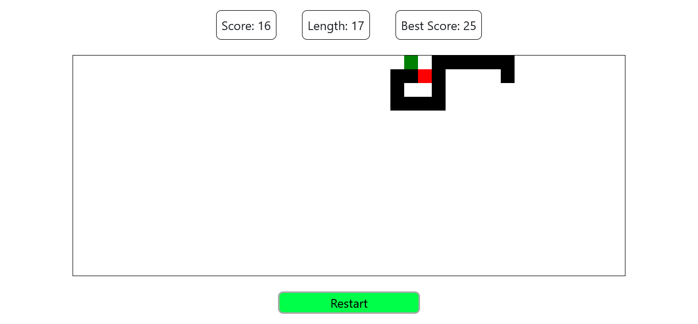

# Snake Game

## Technology used

this game is made using only html,css,javascript

## Mechanics

firstly you choose the mode from the navbar

- normal mode -> just normal without any additions

- wrapless mode -> like normal mode but if you hit a boundary you come out of the other side

- twin mode -> like normal mode but when you eat a fruit your head and tail switch

- wall mode -> like normal mode but every 2 fruits you eat a wall appears that if you bump into you lose

## How to play

use the WASD keys to move

the game starts witht the first WASD key press

try to not hit the boundary and do not bump into yourself

collect fruits to increase your score and length

try to get the highest score

## How to try it

just use the github pages link

https://zezo386.github.io/snake-game/

## How to clone

just use this code in the terminal

`git clone https://github.com/zezo386/snake-game/`

## Author

made by Zaid Elhusiny the GOAT of programming
